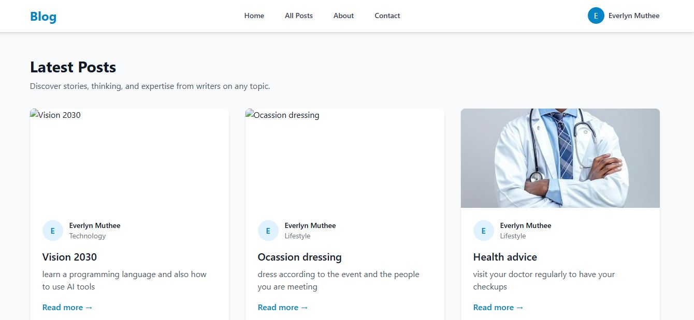
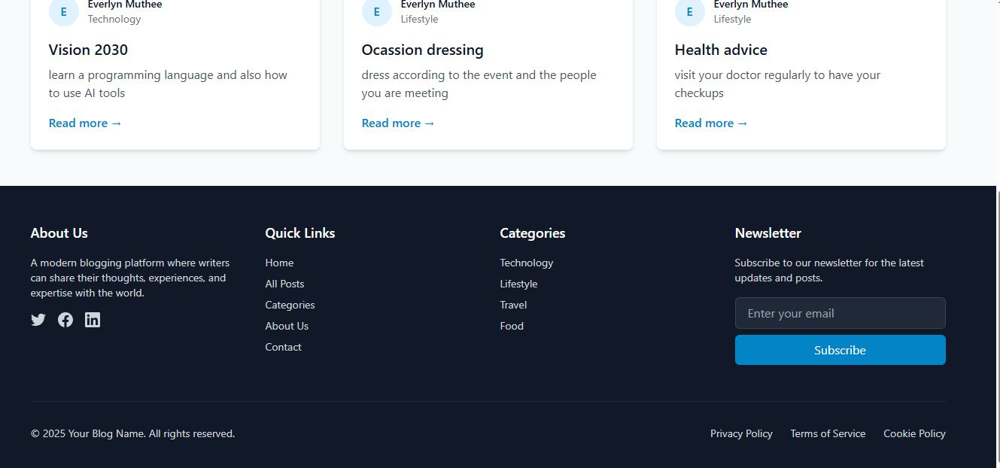

[](https://classroom.github.com/online_ide?assignment_repo_id=19730720&assignment_repo_type=AssignmentRepo)
# Blog Application

A full-stack MERN (MongoDB, Express.js, React.js, Node.js) blog application with user authentication, post management, and category organization.

## Features

- User Authentication (Register, Login, Logout)
- Create, Read, Update, and Delete (CRUD) blog posts
- Category management
- Responsive design with Tailwind CSS
- Image upload support
- Comment system
- User profiles
- Search functionality
- Category-based post filtering

## Tech Stack

### Frontend
- React.js
- React Router for navigation
- Tailwind CSS for styling
- React Hot Toast for notifications
- Axios for API requests

### Backend
- Node.js
- Express.js
- MongoDB with Mongoose
- JWT for authentication
- Multer for file uploads

## Setup Instructions

### Prerequisites
- Node.js (v14 or higher)
- MongoDB
- npm or yarn

### Backend Setup
1. Clone the repository
2. Navigate to the server directory:
   ```bash
   cd server
   ```
3. Install dependencies:
   ```bash
   pnpm install
   ```
4. Create a `.env` file in the server directory with the following variables:
   ```
   PORT=5000
   MONGODB_URI=your_mongodb_connection_string
   JWT_SECRET=your_jwt_secret
   ```
5. Start the server:
   ```bash
   pnpm start
   ```

### Frontend Setup
1. Navigate to the client directory:
   ```bash
   cd client
   ```
2. Install dependencies:
   ```bash
   pnpm install
   ```
3. Create a `.env` file in the client directory:
   ```
   VITE_API_URL=http://localhost:5000/api
   ```
4. Start the development server:
   ```bash
   pnpm run dev
   ```

## API Documentation

### Authentication Endpoints

#### Register User
- **POST** `/api/auth/register`
- **Body:**
  ```json
  {
    "name": "John Doe",
    "email": "john@example.com",
    "password": "password123"
  }
  ```

#### Login User
- **POST** `/api/auth/login`
- **Body:**
  ```json
  {
    "email": "john@example.com",
    "password": "password123"
  }
  ```

### Post Endpoints

#### Get All Posts
- **GET** `/api/posts`
- **Query Parameters:**
  - `page`: Page number (default: 1)
  - `limit`: Posts per page (default: 10)
  - `category`: Filter by category
  - `search`: Search in title and content

#### Get Single Post
- **GET** `/api/posts/:id`

#### Create Post
- **POST** `/api/posts`
- **Body:**
  ```json
  {
    "title": "Post Title",
    "content": "Post Content",
    "category": "category_id",
    "image": "image_url"
  }
  ```

#### Update Post
- **PUT** `/api/posts/:id`
- **Body:** Same as Create Post

#### Delete Post
- **DELETE** `/api/posts/:id`

### Category Endpoints

#### Get All Categories
- **GET** `/api/categories`

#### Create Category
- **POST** `/api/categories`
- **Body:**
  ```json
  {
    "name": "Category Name"
  }
  ```

## Features Implemented

1. **User Authentication**
   - Registration with email and password
   - Login with JWT authentication
   - Protected routes for authenticated users

2. **Post Management**
   - Create new blog posts with title, content, and image
   - Edit existing posts
   - Delete posts
   - View all posts with pagination
   - View individual post details

3. **Category System**
   - Create and manage categories
   - Filter posts by category
   - Category-based navigation

4. **User Interface**
   - Responsive design using Tailwind CSS
   - Modern and clean UI
   - Loading states and error handling
   - Toast notifications for user feedback

5. **Additional Features**
   - Image upload support
   - Search functionality
   - Comment system
   - User profiles

## Screenshots




## Contributing

1. Fork the repository
2. Create your feature branch (`git checkout -b feature/AmazingFeature`)
3. Commit your changes (`git commit -m 'Add some AmazingFeature'`)
4. Push to the branch (`git push origin feature/AmazingFeature`)
5. Open a Pull Request

## License

This project is licensed under the MIT License - see the LICENSE file for details.

## Project Structure

```
mern-blog/
├── client/                 # React front-end
│   ├── public/             # Static files
│   ├── src/                # React source code
│   │   ├── components/     # Reusable components
│   │   ├── pages/          # Page components
│   │   ├── hooks/          # Custom React hooks
│   │   ├── services/       # API services
│   │   ├── context/        # React context providers
│   │   └── App.jsx         # Main application component
│   └── package.json        # Client dependencies
├── server/                 # Express.js back-end
│   ├── config/             # Configuration files
│   ├── controllers/        # Route controllers
│   ├── models/             # Mongoose models
│   ├── routes/             # API routes
│   ├── middleware/         # Custom middleware
│   ├── utils/              # Utility functions
│   ├── server.js           # Main server file
│   └── package.json        # Server dependencies
└── README.md               # Project documentation
```

## Getting Started

1. Accept the GitHub Classroom assignment invitation
2. Clone your personal repository that was created by GitHub Classroom
3. Follow the setup instructions in the `Week4-Assignment.md` file
4. Complete the tasks outlined in the assignment

## Files Included

- `Week4-Assignment.md`: Detailed assignment instructions
- Starter code for both client and server:
  - Basic project structure
  - Configuration files
  - Sample models and components

## Requirements

- Node.js (v18 or higher)
- MongoDB (local installation or Atlas account)
- npm or yarn
- Git

## Submission

Your work will be automatically submitted when you push to your GitHub Classroom repository. Make sure to:

1. Complete both the client and server portions of the application
2. Implement all required API endpoints
3. Create the necessary React components and hooks
4. Document your API and setup process in the README.md
5. Include screenshots of your working application

## Resources

- [MongoDB Documentation](https://docs.mongodb.com/)
- [Express.js Documentation](https://expressjs.com/)
- [React Documentation](https://react.dev/)
- [Node.js Documentation](https://nodejs.org/en/docs/)
- [Mongoose Documentation](https://mongoosejs.com/docs/) 